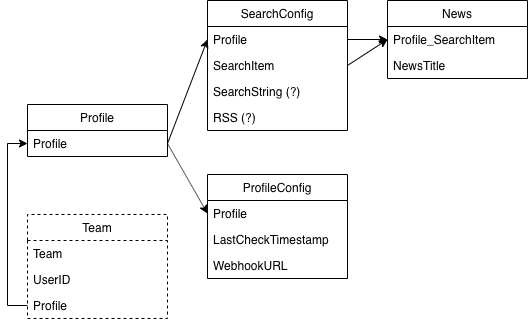
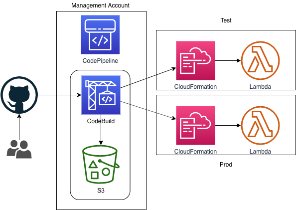
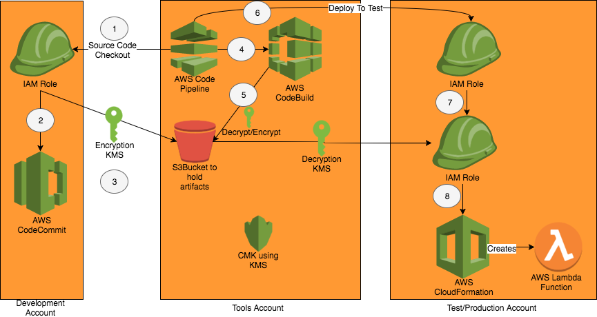

# news-feed-handler

Handle RSS feeds, dedup, filters and publish to messaging channels (e.g. Chime, Slack)

## Architecture

## Data model

## CICD cross accounts

Notes: Management account does not sound like a good idea compared to using Master account. CFN stackset is only supporting Master account.

Following are not exact match, but it explains how cross account works with CodePipeline and CloudFormation

1. Cross account role (PassRole) and CFN role on the remote account

**Important**:

1. This option is selected (vs. jenkins, circle.ci) so it can be applied to other non-lambda workloads.
1. Both CodeBuild's service role and CodePipeline's service role need to be configured as KMS key's users.
1. On the CICD account, following are required components.
   * Roles for: CodePipeline, CodeBuild, CloudFormation (for Deploy stage), and Lambda function. CodePipeline's role must have policy allowing assuming roles in remote accounts.
1. On remote accounts, following are required components.
   * Account role that allows CICD account to assume necessary roles in remote account. This role must have
     * CloudFormation
     * iam:PassRole
     * Access to CICD's S3 artifact bucket
   * Service role for the pipeline, in this case specifically for the deploy stage (cloudformation).
   * Lambda role for the lambda function.

## Project components

1. Lambda: using CloudFormation
1. DynamoDB: using CDK

## Notes

### Google news RSS format

[https://news.google.com/rss/search?hl=en-SG&gl=SG&ceid=SG:en&q=%22search+word%22](https://news.google.com/rss/search?hl=en-SG&gl=SG&ceid=SG:en&q=%22search+word%22)

### Installations

pip install boto3
pip install feedparser
pip install requests

### AWS learning points

1. Registering accounts to Isengard deletes lots of disruptive resources (IAM roles, etc)
1. Setup different accounts for dev/prod
1. Copying dynamodb tables from an account to another is possible through DataPipeline. For a quick fix, use "scripts/copyDynamoTablesAcrossAccounts.py".
1. Options for cross-account deployments
   1. CloudFormation stackset or CloudFormation cross account (through assume-role)
      * CodePipeline can only deploy one artifact (eg CloudFormation template) per action
     *. CodePipeline cannot directly deploy a StackSet, which would allow for deployment of templates across accounts. StackSets can be deployed by calling CodeBuild / Lambda.
      * CodePipeline can deploy to other accounts by specifying a role in that other account. This only deploys to one account at a time. **Notes** this feature can only be achieved through CLI/API and not by the GUI.
      * CodeBuild started as part of a CodePipeline running in a container gives more flexibility, you can do whatever you like here really
      * CodePipeline can start Lambda, which is very flexible.
   1. Put artifacts to S3 and have separate pipelines on remote accounts (not ideal - I would want CICD centralized at one management account)
   1. Have another tool such as jenkins to do this job. Probably use SLS for lambda if this is the chosen option.
1. Detailed notes on cross-account deployment with CodePipeline and CloudFormation
[ref](https://aws.amazon.com/premiumsupport/knowledge-center/codepipeline-deploy-cloudformation/)
   * For Lambda CloudFormation, CodeBuild generate another template (i.e. .yml) which refers to a zip package with actual code. This zip package may be stored in an S3 bucket different from the CodePipeline's artifacts bucket. Since accountB's CloudFormation (which uses outputtemplate.yml) it needs permission to access to the S3 bucket that has the zip package.
   * KMS key is used by CodeBuild to create encrypted artifacts. For Lambda CloudFormation build, artifacts only contains outputtemplate.yml
1. There is no obvious way to get more logs from CodePipeline's deploy stage. Sometimes, very brief error message made it challenging to debug.
1. It has been a while since I touched Nodejs - I can say the Dinosaur is now a Godzilla
   * DO NOT delete generated S3 bucket amplify-{appName}-{env}-171328-deployment 
   * aws-apollo 3 and 2 works totally differently! Had hard time with v3, so I downgraded to v2
   * amplify hosting (cicd from github)!
   * amplify graphql needs "id: ID!" even though AppSync console does not need it (This is not true! Probably caused by sth else)
   * key={profile.id} shuts off console's warnings
1. Sometimes, S3 bucket would need 24h to be propagated across regions. Amplify does not specify region for s3, so there is rare chance APIs failed due to this issue.
