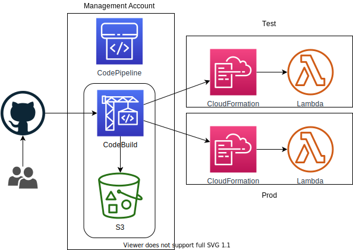

# news-feed-handler

Handle RSS feeds, dedup, filters and publish to messaging channels (e.g. Chime, Slack)

## Features

1. Segregate profiles/search configurations by user ID
1. Display retrieved news (Notes: if profile/search records are deleted, associated news will not be displayed)

## Architecture

## Data model

## CICD cross accounts

Notes: Management account does not sound like a good idea compared to using Master account. CFN stackset is only supporting Master account.

Following are not exact match, but it explains how cross account works with CodePipeline and CloudFormation

1. Cross account role (PassRole) and CFN role on the remote account

**Important**:

1. This option is selected (vs. jenkins, circle.ci) so it can be applied to other non-lambda workloads.
1. Both CodeBuild's service role and CodePipeline's service role need to be configured as KMS key's users.
1. On the CICD account, following are required components.
   * Roles for: CodePipeline, CodeBuild, CloudFormation (for Deploy stage), and Lambda function. CodePipeline's role must have policy allowing assuming roles in remote accounts.
1. On remote accounts, following are required components.
   * Account role that allows CICD account to assume necessary roles in remote account. This role must have
     * CloudFormation
     * iam:PassRole
     * Access to CICD's S3 artifact bucket
   * Service role for the pipeline, in this case specifically for the deploy stage (cloudformation).
   * Lambda role for the lambda function.

## Project components

1. Lambda: using CloudFormation
1. DynamoDB: using CDK

## Notes

### Google news RSS format

[https://news.google.com/rss/search?hl=en-SG&gl=SG&ceid=SG:en&q=%22search+word%22](https://news.google.com/rss/search?hl=en-SG&gl=SG&ceid=SG:en&q=%22search+word%22)

### Installations

pip install boto3
pip install feedparser
pip install requests

## Manual steps

1. Amplify lambda function role (to invoke other lambdas)

## All the hoops

1. Failed to get feeds from local OSX testing: there's some certificate stuff that needs to be installed when using Python 3.6. Essentially go to /Applications/Python 3.X and run the Install Certificates.command
1. It looks like relational database would be a better choice for Profile/SearchConfig with many occasions joins and data integrity is needed (e.g. deleting profile should be cascaded for search config and news)

## Versions and resources

1. V1
1. V2 - GUI
1. V3 - News quality with Data pipelines and AI/ML
   * https://www.kaggle.com/rootuser/worldnews-on-reddit
   * https://scikit-learn.org/stable/auto_examples/text/plot_document_clustering.html
   * https://en.wikipedia.org/wiki/Tf%E2%80%93idf

## Tips and tricks

1. 'Search string' needs to be fined tune manually (until we have AI/ML elements in this program). For examples, if we are searching for news for company Wiz.AI.
   * If the search string is "Wiz", you may have got news from "Wiz Khalifa" which you probably don't want
   * If the search string is "Wiz.AI", the results will be more relevant
1. 'amplify publish -c' invalidates cloudfront's cache
